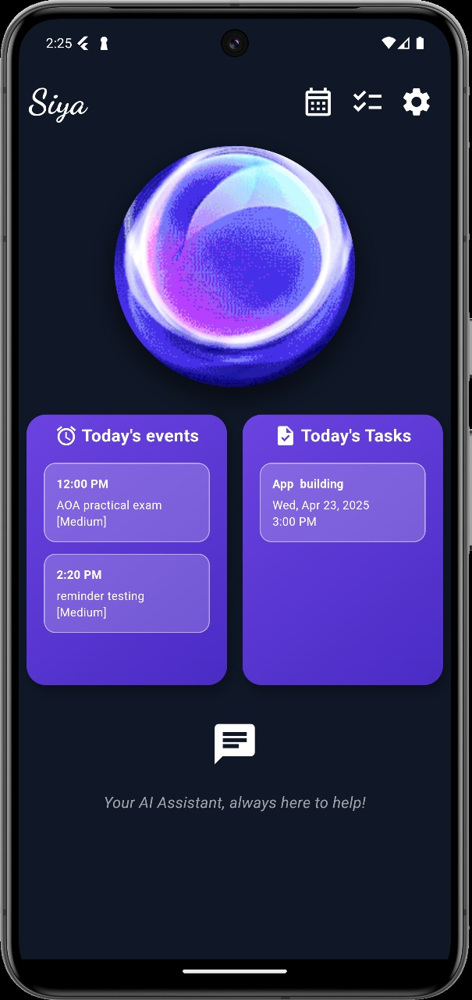
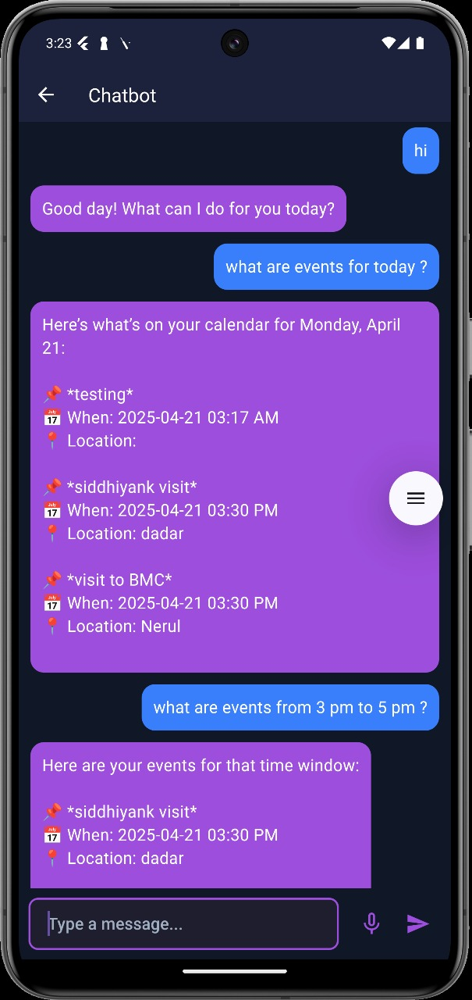
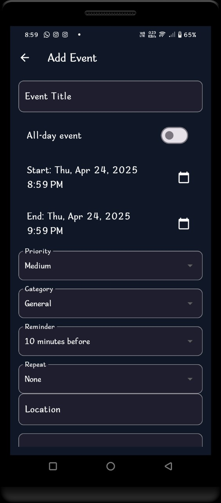
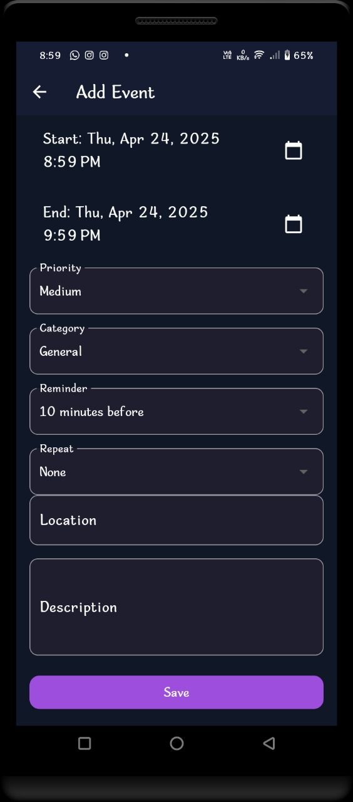
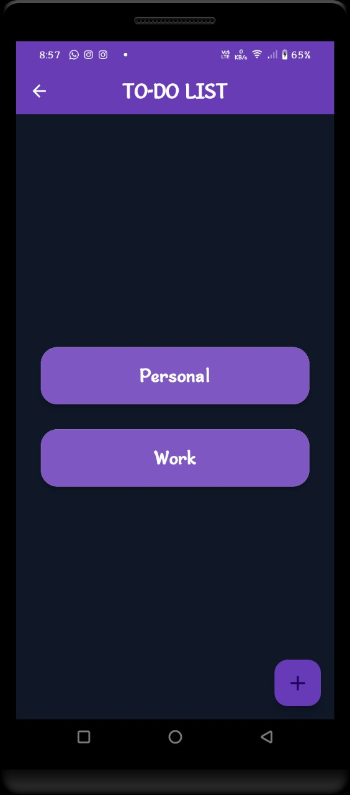
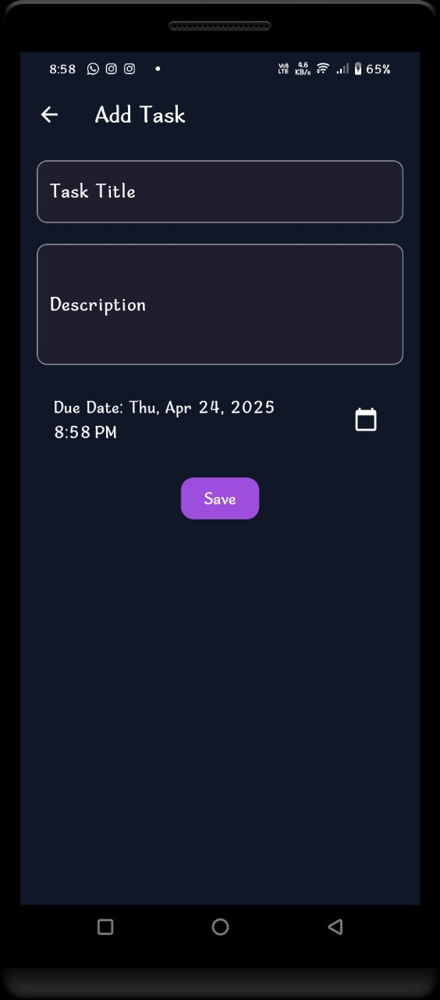

# 🧠 TaskMate_AI – Smart Task & Event Scheduler

**TaskMate_AI** is your intelligent companion for conquering chaos!  
This smart mobile app helps you effortlessly organize your life — add, update, or delete tasks and events, get perfectly timed reminders, and chat with an NLP-powered assistant that *actually understands you*. Want to know what’s on your plate today? Just ask. Curious about events next Tuesday? Your chatbot's got you covered.

With TaskMate, scheduling isn't just productive — it's interactive, intuitive, and a little bit magical. ✨

---

## 🚀 Features

- 📅 **Task & Event Management** – Add, update, and delete personal or work-related tasks and events  
- 🔔 **Smart Reminders** – Get notification alerts at scheduled times  
- 🤖 **NLP Chatbot Integration** – Ask questions like “What are my tasks today?” and get accurate responses  
- 🗣️ **Voice-Based Interaction** – Speak your queries and hear the answers back  
- 🗃️ **Categorization** – Organize your tasks by personal, family, or team  
- 🌗 **Status Separation** – View active and expired events separately  
- 💫 **Flutter UI** – Clean, animated, and intuitive design for a smooth user experience

---

## 🛠️ Tech Stack

**Frontend:**
- Flutter
- Firebase (Firestore for DB, Local Notifications)

**Backend:**
- Python (Flask)
- Dialogflow (NLP Chatbot)
- Hosted on [Render](https://render.com)

---

## 📂 Folder Structure

**taskmate-ai/**
- **flutter_app/**  → Flutter frontend  
  ├── lib/  
  ├── android/  
  ├── ios/  
  └── ...  

- **backend/**  → Flask + Dialogflow backend  
  ├── app.py  
  ├── requirements.txt  
  └── .gitignore

---

## 📦 Deployment

- 📱 **Frontend:** Run via Flutter on emulator/device  
- 🌐 **Backend:** Hosted on [Render](https://render.com) using `Procfile`  
- 🧠 **Dialogflow:** Integrated with Flask API to handle natural language queries

---

## 📸 Screenshots

### 🏠 Home Screen  

---

### 🤖 Chatbot Interaction  

---

### ➕ Add Event Flow  
<table>
  <tr>
    <td></td>
    <td></td>
  </tr>
</table>

---

### ✅ To-Do List (Tasks)  
<table>
  <tr>
    <td></td>
    <td></td>
    <td></td>
  </tr>
</table>

---

## 🙋‍♀️ About the Developer

Built with ❤️ by **Pratiksha Zodge**  
🎓 Third Year Computer Engineering Student  

---

