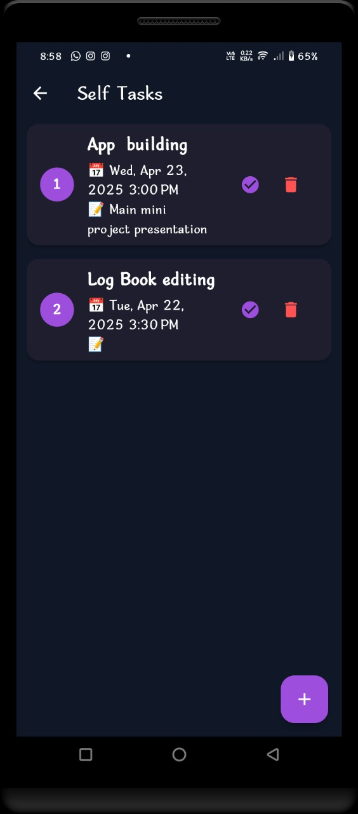

# 🧠 TaskMate – Smart Task & Event Scheduler

TaskMate is a personalized task and event scheduling mobile app that blends natural language interaction with powerful reminders. Built with Flutter and Flask, it uses Dialogflow to let users manage tasks just by chatting.

---

## 🚀 Features
- 📅 Add, edit, and delete personal/work tasks and events
- 🧠 Chatbot interface powered by Dialogflow + Flask backend
- 🗣️ Voice-based interaction – speak your queries, and hear responses back!
- 🔔 Smart notifications and reminders
- 🗃️ Task categories: personal, family, team
- 🌙 Separate sections for active and expired events
- 📊 User-friendly interface with Flutter animations

---

## 🛠️ Tech Stack

**Frontend:**
- Flutter
- Firebase (for Firestore DB and Local Notifications)

**Backend:**
- Python (Flask)
- Dialogflow (NLP chatbot)
- Hosted on Render

---

## 📂 Folder Structure
taskmate-ai/
├── flutter_app/ # Flutter frontend
│ ├── lib/
│ ├── android/
│ └── ...
│
├── backend/ # Flask + Dialogflow backend
│ ├── app.py
│ ├── requirements.txt
│ └── .gitignore 
---

## 📦 Deployment

- Frontend deployed via Flutter (local/device)
- Backend deployed on [Render](https://render.com) using `Procfile`
- Dialogflow integration handled via Flask API

---

## 🔒 Security

- 🔑 `dialogflow-key.json` is excluded using `.gitignore` for safety.
- Always keep secret keys out of version control!

---
## 📸 Screenshots

### 🏠 Home Screen

### 🤖 Chatbot Interaction

### ➕ Add Event Flow

### ✅ To-Do List (Tasks)

---

## 🙋‍♀️ About the Developer

Built with ❤️ by Pratiksha Zodge  
Third Year Computer Engineering Student  
---
